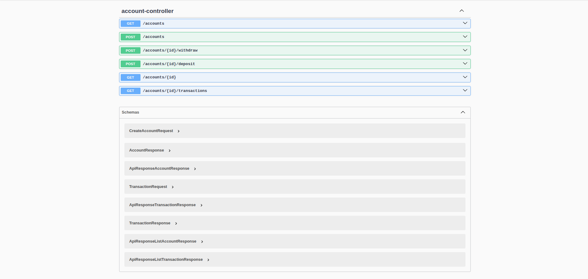

# Banking API


REST API for basic banking operations built with **Java, Spring Boot and MySQL**.

The application allows creating accounts, performing deposits and withdrawals, and viewing the transaction history of each account.

This project was developed as a backend practice project to explore REST API development, database modeling and service-layer architecture using Spring Boot.

## Preview



## Technologies

- Java 17
- Spring Boot 3.2
- Spring Data JPA / Hibernate
- MySQL 8
- Docker + Docker Compose
- Maven
- Lombok

## Project Structure

```text
src/main/java/com/banking/
├── BankingApiApplication.java
├── controller/
│   └── AccountController.java
├── service/
│   └── AccountService.java
├── domain/
│   ├── Account.java
│   ├── Transaction.java
│   └── TransactionType.java
├── repository/
│   ├── AccountRepository.java
│   └── TransactionRepository.java
├── dto/
│   ├── request/
│   │   ├── CreateAccountRequest.java
│   │   └── TransactionRequest.java
│   └── response/
│       ├── AccountResponse.java
│       ├── TransactionResponse.java
│       └── ApiResponse.java
└── exception/
    ├── AccountNotFoundException.java
    ├── DuplicateAccountException.java
    ├── InsufficientBalanceException.java
    └── GlobalExceptionHandler.java
```

## Running Locally

**Pre-requisites**

- Java 17+
- Maven
- MySQL 8 running on port `3306`

Create the database:

```bash
mysql -u root -p -e "CREATE DATABASE banking_db;"
```

Clone the repository and run:

```bash
git clone https://github.com/ArthurOliveira-eng/banking-rest-api.git
cd banking-rest-api
mvn spring-boot:run
```

The API will start at `http://localhost:8080`.

## Running with Docker

```bash
docker-compose up --build
```

Stop containers and remove volumes:

```bash
docker-compose down -v
```

## API Endpoints

| Method | Endpoint                      | Description              |
| ------ | ----------------------------- | ------------------------ |
| POST   | `/accounts`                   | Create a new account     |
| GET    | `/accounts`                   | List all accounts        |
| GET    | `/accounts/{id}`              | Get account by ID        |
| POST   | `/accounts/{id}/deposit`      | Deposit into an account  |
| POST   | `/accounts/{id}/withdraw`     | Withdraw from an account |
| GET    | `/accounts/{id}/transactions` | Get transaction history  |

## Request and Response Examples

**Create Account:**

```bash
POST /accounts
Content-Type: application/json

{
  "holderName": "Arthur Oliveira",
  "document": "123.456.789-00",
  "accountNumber": "0001-1",
  "initialBalance": 2500.00
}
```

**Response:**

```json
{
  "success": true,
  "message": "Account created successfully",
  "data": {
    "id": 1,
    "holderName": "Arthur Oliveira",
    "document": "123.456.789-00",
    "accountNumber": "0001-1",
    "balance": 2500.00,
    "createdAt": "2026-03-10T10:00:00"
  },
  "timestamp": "2026-03-10T10:00:00"
}
```

**Deposit:**

```bash
POST /accounts/1/deposit
Content-Type: application/json

{ "amount": 500.00 }
```

**Withdraw:**

```bash
POST /accounts/1/withdraw
Content-Type: application/json

{ "amount": 200.00 }
```

## Business Rules

- `document` and `accountNumber` must be unique
- `initialBalance` defaults to `0` if not provided
- Deposit and withdrawal amounts must be greater than `0`
- Withdrawals fail if the balance is insufficient (`422 Unprocessable Entity`)
- Monetary values use `BigDecimal` for precision
- Transaction history is returned in reverse chronological order

## HTTP Status Codes

| Code | Meaning                              |
| ---- | ------------------------------------ |
| 200  | OK                                   |
| 201  | Resource created                     |
| 400  | Validation error                     |
| 404  | Account not found                    |
| 409  | Duplicate document or account number |
| 422  | Insufficient balance                 |
| 500  | Unexpected server error              |

## Running Tests

```bash
mvn test
```

## API Documentation

After starting the application, Swagger UI is available at:

```
http://localhost:8080/swagger-ui/index.html
```

## Possible Improvements

- JWT authentication and authorization
- Transfer between accounts
- Pagination for transaction history
- Integration tests with Testcontainers
- Audit trail with Spring Data Envers
- Rate limiting on transaction endpoints
